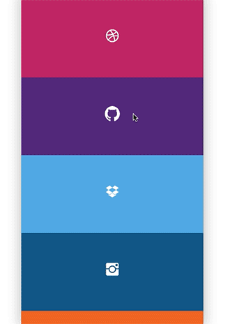

# WZDraggableSwitchHeaderView

#### How far your thumb can reach on the iPhone 6 Plus ?

#### Or, being bored with tapping the button or navigation Item to switch between viewControllers ?


## Quick Look



## About
This project is inspired by Nike's awesome official App [Making of Making Powered by NIKE MSI](https://itunes.apple.com/us/app/making-making-powered-by-nike/id662227880?mt=8).

## Installation
### [CocoaPods](http://cocoapods.org/)

````ruby
# For latest release in CocoaPods
pod 'WZDraggableSwitchHeaderView'
````

Or

````ruby
# Feeling adventurous? Get the latest on develop
pod 'WZDraggableSwitchHeaderView', :git => 'https://github.com/wongzigii/WZDraggableSwitchHeaderView.git', :branch => 'master'
````

## Getting Start

Create an instance of `WZDraggableSwitchHeaderView`:

````objc	
self.headerView = [[WZDraggableSwitchHeaderView alloc] initWithDelegate:self
                                                                      frame:CGRectMake(0,0,self.view.bounds.size.width,50)
                                                          normalStateHeight:20.0f
                                                     heightCanTriggerSwitch:70.0f];
[self.view addSubView:self.headerView];           
````

Implement the delegate method that will be invoked:

````objc
#pragma mark - WZDraggableSwitchHeaderViewDelegate

- (void)WZDraggableSwitchHeaderViewDidTriggerDeepDragging;
{
    [self.navigationController.view.layer addAnimation:[WZAnimatingTransition backwardTransition] forKey:@"transition"];
    [self.navigationController popToRootViewControllerAnimated:NO];
}
````

Hook on the `UIScrollViewDelegate`:

````objc
#pragma mark - UIScrollViewDelegate

- (void)scrollViewDidScroll:(UIScrollView *)scrollView
{
    [self.headerView WZDraggableSwitchHeaderViewDidScroll:scrollView];
}

- (void)scrollViewDidEndDragging:(UIScrollView *)scrollView willDecelerate:(BOOL)decelerate
{
    [self.headerView WZDraggableSwitchHeaderViewDidEndDragging:scrollView];
}
````

Done!       
        
## Customization

````objc
/// The y contentOffset range between normal state and shallow dragging state. If end dragging on this range, `- WZDraggableSwitchHeaderViewDidTriggerShallowDragging` will be invoked.
/// Default is 20.0f.
@property (nonatomic, assign) CGFloat normalStateHeight;

/// The total height of this header view will trace down with. End up dragging on the y contentOffset if less than `heightCanTriggerSwitch`, `- WZDraggableSwitchHeaderViewDidTriggerDeepDragging` will be invoked properly.
/// Default is 70.0f.
@property (nonatomic, assign) CGFloat heightCanTriggerSwitch;

/// The status label shows the text of state.
@property (nonatomic, strong) UILabel *statusLabel;

/// The button can be tapped to return to menu.
@property (nonatomic, strong) UIButton *backButton;

/// The layer of arrow Image.
@property (nonatomic, strong) CALayer *arrowImage;

/// The state of this headerView.
@property (nonatomic, assign) WZDraggableSwitchState state;

/// The text will show in normal state. Default is `ABOUT`.
@property (nonatomic, strong) NSString *normalStateText;

/// The text will show on shallow dragging state. Default is `PULL TO RETURN TO MENU.`
@property (nonatomic, strong) NSString *shallowStateText;

/// The text will show on deep dragging state. Default is `RELEASE TO RETURN TO MENU.`
@property (nonatomic, strong) NSString *deepStateText; 
````

## Contact
- If you have some advice, open an issue or PR
- Email [me](mailto:wongzigii@outlook.com)

## Credits

Logo : 

- [Iconic](https://github.com/somerandomdude/Iconic)

- [Logo/Emblem/Mark for Hypercompact](https://dribbble.com/shots/197202-Logo-Emblem-Mark-for-Hypercompact?list=searches&offset=4)

Font : 

- Fundamental Brigade Schwer Copyright (c) 2012  by Peter Wiegel.

## License
WZDraggableSwitchHeaderView is available under the MIT license, see the [LICENCE](./LICENSE) file for more info.
